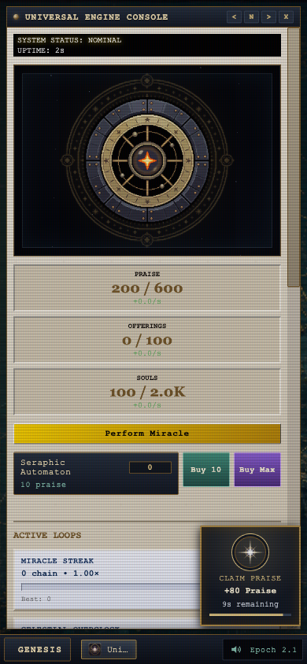

# CosmOS — interaction, depth, and the House

This pass starts from the current project at `Machine Dreams/projects/CosmOS`, including Claude’s merged Import Save / Hard Reset fix (PR #10). The older checkout attached to this chat is not the implementation target. The July `DESIGN_DIRECTION.md` remains the aesthetic and strategy reference; its inventory of missing features is historical. Patience.exe, Fate’s dialogue, Incidents, Reality Builds and the endings are now implemented.

The strongest direction is **sacred maintenance desktop**: cast iron for machinery, vellum for records, brass for actions and ritual. The primary pattern is the existing desktop window manager; the secondary pattern is a strategy HUD with resources, current objective and a meaningful next action. Keep Georgia for the institution and Courier for the machine. Improve hierarchy and legibility before adding more decoration.

## Implemented in this pass

- Dev Console delegates reload shutdown to `State.abandonPage()` rather than maintaining a second implementation.
- Prophet meals carry resource identity and an absolute expiry. Reloads retain the remaining duration rather than granting a permanent multiplier. Overlapping meals still stack and expire separately. Saves from the older implementation cannot supply a deadline; their unbounded feeding multiplier is retired. Temporary feeding does not inflate offline accrual, consistent with the other transient production boosts. The Globe explains this and shows the next deadline.
- Calls update their shared cooldown and balance while open. They explain insufficient resources and a full vault. A conversion cannot charge resources or begin cooldown when the entire Adoration reward would not fit.
- Globe followers/rates and shop balance/affordability update while open.
- Upgrade, Mandate and shop rows support Tab, Enter and Space. Their focus stays with the purchased row when it redraws; Space does not also perform a Miracle. Purchased and prerequisite-locked rows declare their disabled state.
- Mandate certification uses an opaque iron backing and readable status inks. Dormant/lapsed branches use a dashed rail instead of reducing the opacity of all their text. Locked and unaffordable nodes keep readable descriptions and explicit status labels. The ending’s act button occupies the transcript’s text column instead of the narrow speaker column.
- Praise events are buttons with a brass seal, a claim label, actual bankable Praise, a deadline and a progress rail. They stay within a narrow viewport, announce availability without taking focus, and honor reduced motion. Claims past the deadline are rejected even between simulation ticks. Full-vault claims still count toward the existing event chain; the tooltip explains that distinction.
- Optional brass arrow/hand cursors can be enabled in Divine Settings and persist across reloads. System cursors remain the default. Text, dragging, resize and disabled cursors keep their existing meanings. No trailing particles or substitute DOM cursor.

## UI/UX: the next improvements, in order

### 1. Make the active task visible in the Engine

At the default desktop size, the cinematic core is the strongest visual element, but the directive and claim action sit lower in the window. The operator panel says a reward is ready while offering only “Open Universal Engine.” On a 390px-wide phone, the core and three stacked resource boxes consume most of the height before the automaton row, loops and directive.

Put a compact resource strip and the active directive immediately above the main action. Keep that strip inside the window’s scroll container with a sticky backing. It should show current/cap, **net** rate and a clear full-vault marker. Below it: one primary contextual action. Before automation, that is Perform Miracle. When a directive completes, expose Claim Directive beside it. Leave purchase controls available rather than changing their positions on every tick.

After the first Seraph, let the operator collapse the core into a small seal. Remember that choice per device/layout. Retain the first Seraph cinematic; it is one of the clearest moments where an economic purchase acquires a personality. On phones, start with a shorter core after that reveal and place resources in a compact grid. Keep the taskbar as navigation, not another persistent HUD.

The operator panel can focus the relevant Engine section or claim a completed directive, with the full reward shown first. A state saying “ready” should lead to that action in one click.

**Check:** at 390×844, resources, objective and its action should be visible together; opening another app must preserve the Engine’s scroll position. Keyboard focus must not be hidden under a sticky strip.

### 2. Separate atmosphere from readability

Scanlines, colored CRT subpixels, textured vellum and small machine text accumulate. The aesthetic is strong, but the combined filter erodes the difference between enabled controls, disabled controls and ordinary readouts. Performance Mode currently changes several unrelated things, including the core and CRT.

Add Display settings: CRT intensity Off / Low / Full, and text scale 100 / 115 / 130%. Use Low as an audition, not an untested global replacement. Keep atmosphere strongest on the wallpaper and core well; important reading surfaces need calmer contrast. Do not animate resource numbers continuously when a simple stable update will do.

Keep critical labels around 12–13px where the layout allows; reserve 10px machine type for metadata. Use the existing semantic inks on vellum and inverse inks on iron. Selected, exhausted, full and unaffordable states need explicit labels rather than color alone. Touch window controls need larger hit regions even if their visible glyphs retain their retro size.

### 3. Reward feedback should explain the transaction

The praise seal now distinguishes offered reward from available storage. The same principle should apply to directives, purchases and conversion: tell the operator what was spent, what arrived, and what changed. A purchase receipt such as “Seraph commissioned · net Praise +1/s” gives the action meaning. Avoid showing a huge nominal reward and quietly clipping it to storage.

For art, develop a family of reward stamps: Praise = halo/seal, Offerings = liturgical vessel, Souls = tagged ledger/lantern. Use silhouette plus label, not three colors of the same sparkle. The existing flare is useful as light inside the seal, but is too abstract to communicate a resource on its own. Keep one arrival and one claim burst; continuous bobbing is less valuable than an obvious deadline.

Event spawns should eventually choose a free desktop region, avoiding active modal controls, titlebar buttons and the main Miracle button. On mobile, a consistent edge position is easier to find than a random position over controls. This first pass bounds the token; it does not yet solve all overlap cases or provide an extended-time accessibility mode.

### 4. Make the art family consistent

The desktop plates, metal core, Seraph reveal and app plaques share a distinctive visual language. The Globe’s smooth blue sphere and flat colored regions feel comparatively generic. Art effort is better spent there than on additional window ornament.

Redesign the Globe as a brass armillary/etched atlas: consistent orbital line weight, engraved sector marks, assigned Prophets as small indexed markers, and readable region selection. Keep the numbers in DOM. The state should be legible without watching animation. Draw local hover/focus and selection feedback; don’t make every region glow all the time.

The optional cursor set is deliberately small and reversible. A more ornate cursor risks obscuring tiny controls. Test at native size over both wallpaper and vellum before adding animated busy glyphs or purchasable cursor variants.

## Gameplay depth: strengthen decisions already present

CosmOS’s best loop is: notice a problem → choose where to spend → see the universe react → ship a build that records the decision. Reality Build regressions, certification, Incidents and NULL.OPERATOR already support that. New games should feed that loop or give the operator a useful break from it.

| Resource | Existing uses | What could make spending deeper |
| --- | --- | --- |
| Praise | Automation, upgrades, vaults/refinement, Prophet meals, incident payments, Patience mulligans | Maintenance contracts, controlled interventions, collectible desk artifacts |
| Offerings | Conversion infrastructure, upgrades, Prophet meals, incident work | Ritual plans that trade efficiency against one incident’s severity |
| Souls | Progression, calls, Prophet meals, unlocks | A clearly priced short-term concession with a recorded moral consequence |
| Adoration | Cosmetics, repeated utilities/Prophet improvements, Patience install | Collections and convenience with bounded strength; clearer descriptions of lasting purchases |
| Divinity / Echoes | Mandates, doctrines and progression | Preserve certification’s opportunity cost; show what a chosen path changes |

Patience already uses Praise sinks: undo costs 5% of Praise capacity and reshuffle 15% (30 and 90 at the starting 600 cap). Its payout fatigue gives full rewards to the first three rounds each hour. It is already a themed desktop game with Fate at the table. Improve its discoverability and explanation before treating it as missing content.

Three useful new choices:

1. **Maintenance contracts.** Buy a short attended-time service for one production line: reduce its next incident escalation, accept a temporary output tax. It must be capped, mutually exclusive on that line, and shown in the production breakdown. Paying to automate one recurring annoyance competes with expanding production. No penalties while the operator is away.
2. **Prophet dispatch.** Assign a Prophet either to followers or to an incident. Dispatch temporarily lowers follower growth and substitutes for one paid repair step. It gives Prophets a tactical purpose and makes the Globe relevant beyond assignment once and forgetting it. Start with one incident family rather than redesigning every ticket.
3. **A cabinet of retired universes.** Buy cosmetic desktop artifacts and annotated records with surplus Praise. Each purchase adds a piece of authorship to the desk and a small reaction from the institution or Fate. No permanent output multiplier required. Favor a finite collection with clear progress over an endless escalating store.

Avoid adding another currency, unbounded compound upgrades, or mandatory timed chores. A sink that only returns more production quickly becomes another required growth purchase. A good optional sink trades something the operator values for convenience, expression, story or a different way to handle a run.

## The House of Deferred Consequences

The user’s casino suggestion can fit the dark comedy. It revisits the July direction’s deliberate cut of a separate casino venue, so treat it as a small prototype built around Patience and Fate, with a clear stop condition. A full three-minigame venue would compete with finishing the existing strategy systems.

**Premise:** the celestial administration monetizes certainty. Fate runs the employee recreation concession; winnings are filed as “evidence that the system remains fair.” Souls are patrons with claims and paperwork, rather than anonymous chips whose removal is invisible.

**First prototype: Providence Audit.** A short desktop table, one optional round at a time. Stake 5% of Praise capacity, using Patience’s existing pricing language. Before dealing, show the stake, three possible policies and the complete outcome probabilities. The operator chooses a policy, then reveals three stamped claims and files the result. A round lasts roughly 30–60 seconds and survives reload as the same deal.

An initial balance audition can use this explicit sink table:

| Outcome | Probability | Praise returned | Flavor |
| --- | ---: | ---: | --- |
| Approved | 25% | 1.5× stake | “Your miracle was approved. Please stop looking surprised.” |
| Deferred | 50% | 0.5× stake | “Half your certainty has been returned as a courtesy.” |
| Denied | 25% | 0 | “A tragedy has been classified as a teaching opportunity.” |

The expected Praise return is 62.5% of the stake, so the expected sink is 37.5%. These are proposed tuning values, not tested economy changes. Deterministic small consolation progress can unlock desk artifacts, recovered memos and additional Fate responses. Losing cannot erase permanent progress or create an infinite debt.

To give it agency beyond roulette, the three policies should redistribute the same approximate expected return: one predictable small refund, one balanced spread, one volatile spread. The probabilities and consequence remain visible before confirmation. A revealed claim might name the affected sector and change the next line of copy or a decorative filing stamp, but it must not silently cripple production. Test whether choosing the policy and reading the claim is interesting before adding more rules.

Use the already authored Fate dialogue where its trigger fits; write only missing lines. Let NULL.OPERATOR occasionally challenge the premises after contact. Examples of the comic register: “The house has no edge. It has jurisdiction.” / “All outcomes have been audited by the department that sold them.” Aim the joke at the bureaucracy and the institution’s manufactured mercy.

**Prototype acceptance:** no reload reroll, no duplicated payout, full odds visible, no resource overdraft, no mandatory participation, keyboard/touch operation, muted chatter supported, no economic effect from merely opening the app. At least two playtesters should want a second round for the decision or story, not because it is the fastest way to progress.

If that prototype feels like a passive slot machine, stop. A stronger second desktop game would be **Hymnal Checksum**: spend Praise to buy a corrupted score, solve a brief matching puzzle, and choose a usable repair token or an archive fragment. Skill and a choice of payoff make it more interesting than adding another random payout button. Prototype one of these, not both at once.

## Recommended next sequence

1. Compact Engine objective/resource layout; explicit action from the operator panel.
2. CRT and text-scale controls; larger touch hit regions.
3. Prophet dispatch on one incident family, with observable tradeoff.
4. One House prototype using the existing table/dealer infrastructure.
5. Globe art replacement and reward icon family after the interactions are stable.

Measure spend vs production, time to first Seraph, time from “reward ready” to claim, voluntary sink use, and how often players leave an affordable action unnoticed. These need instrumentation/playtests before numerical targets can be credible. A long economy simulation checks pacing but cannot prove an optional activity is fun.

## Verification and evidence

All 17 targeted suites/check groups passed: save migration (20), export/import logic (20), Dev Console logic (39), Fate (41), modifier equivalence (78), production breakdown (21), new economy regressions (5), golden economy horizons (3), new UI/reload browser scenarios (14), accessibility (25), window layout (7), endings (23), export/import browser (6), smoke flow, Dev Console browser (49), idle browser (10), and release packaging (7). The broad browser checks ran serially. This is targeted validation, not a run of every package script.

The new browser scenarios explicitly require achievement/document writes and a **delivered** mail after abandonment, with a 25ms autosave for Hard Reset, then verify the fresh page saves normally. Feeding is checked against the real follower production rate across reload and expiry. Keyboard focus, Space/Enter, full-vault conversion, live balances, narrow-screen containment, reduced motion and measured contrast are covered. The three endings each assert that the act label fits inside its button.

The 2h, 8h and 2h idle golden economy results are unchanged. Release output was rebuilt and excludes Dev Console. No player profile was used: browser checks used isolated contexts. Chromium desktop and a 390×844 viewport were exercised; Firefox, WebKit, physical touch and subjective audio quality remain unverified.

Visual evidence (fixtures, not a player's save): [desktop praise seal](ui-evidence-2026-10-04/praise-desktop.png), [mobile praise seal](ui-evidence-2026-10-04/praise-mobile.png), [readable Mandates](ui-evidence-2026-10-04/mandates.png).

